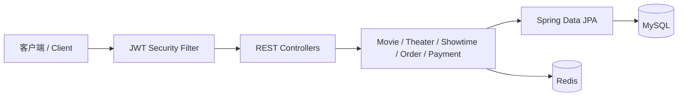
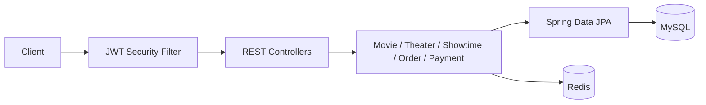

# Movie Reservation System | 电影订票系统

[中文](#中文说明) · [English](#english)

基于 Spring Boot 构建的电影订票后端学习项目，重点实践高并发下单、座位一致性、Redis 缓存与限流、订单超时、支付回调幂等以及数据库版本管理。

A Spring Boot backend learning project focused on concurrent seat booking, consistency, Redis caching and rate limiting, order expiration, idempotent payment callbacks, and database migrations.

项目最初的需求灵感来自 [roadmap.sh Movie Reservation System](https://roadmap.sh/projects/movie-reservation-system)。

The original project brief was inspired by [roadmap.sh Movie Reservation System](https://roadmap.sh/projects/movie-reservation-system).

Updated On 2026-9-26


---

## 中文说明

### 项目要点

- 使用 JWT 和 Spring Security 实现无状态鉴权，支持系统管理员、影院管理员和顾客角色。
- 按影院分配管理员，并在业务层校验影院级数据权限。
- 采用 “实体座位/场次座位/订单座位”分离的数据结构管理座位
- 使用 MySQL 悲观锁、事务和唯一约束防止座位超卖与重复下单。
- 使用 客户端的`requestId`、Redis的 `SET NX` 和数据库唯一键实现订单幂等。
- 使用 Redis Lua 脚本实现按用户滑动窗口限流和安全释放分布式锁。
- 电影详情缓存支持空值缓存、随机 TTL、互斥重建防止缓存问题，并且有Redis 异常降级。
- 使用 Redis ZSet 保存订单过期时间，并保留 MySQL 定时扫描作为最终兜底。
- 支付系统包含支付流水、模拟支付网关、回调验签、回调事件去重、迟到支付和退款状态处理。
- 核心订单、支付、缓存、影院和场次业务均有单元测试；Redis 另有可选集成测试。

### 技术栈

| 类别 | 技术 |
| --- | --- |
| 应用框架 | Java 25、Spring Boot 4.1、Spring Web MVC |
| 数据访问 | Spring Data JPA、Hibernate、MySQL、Flyway |
| 缓存与并发控制 | Redis、StringRedisTemplate、Lua、ZSet |
| 安全 | Spring Security、JWT、BCrypt、基于角色和影院归属的授权 |
| 数据映射与校验 | MapStruct、Jakarta Validation、Lombok |
| 支付 | Payment Gateway 抽象、Mock Gateway、HMAC-SHA256 回调验签 |
| 测试 | JUnit 5、Mockito、Spring Boot Test、真实 Redis 可选集成测试 |

### 架构概览



项目采用按业务模块组织的模块化单体结构。MySQL 是订单、支付和座位状态的最终事实来源；Redis 用于加速查询、请求准入、限流和过期订单调度。

### 核心业务设计

#### 订单创建与防超卖

1. 用户身份从 JWT 获取，不接受客户端指定用户 ID。
2. `(user_id, request_id)` 唯一约束提供最终幂等保证。
3. Redis 请求锁减少同一请求的并发处理，数据库查询覆盖锁与事务提交之间的竞争窗口。
4. Lua 滑动窗口限制单个用户的短时间下单次数。
5. 创建订单时对所选 `ShowtimeSeat` 加悲观写锁。
6. 服务端根据场次价格计算总金额，并在同一事务中创建 `OrderSeat` 和锁定座位。

#### 缓存策略

- 电影详情使用 Cache-Aside 模式。
- 不存在的电影缓存为 `__NULL__`，降低缓存穿透风险。
- 正常缓存 TTL 增加随机偏移，降低缓存雪崩风险。
- 热点缓存失效时使用 Redis 互斥锁和二次查询降低缓存击穿风险。
- Redis 不可用时降级查询 MySQL保障业务逻辑正常进行。

#### 订单超时

- 创建订单后将 `orderId` 写入 `order:expiry` ZSet，score 为过期时间毫秒值。
- Redis 调度器按批读取已到期候选订单。
- 数据库事务重新锁定订单并检查真实状态和 `expiresAt`。
- 新过期订单释放座位并关闭活动支付流水；已终态或不存在的订单清理 ZSet 残留；尚未到期或处理异常的订单保留重试。
- MySQL 分页扫描作为 Redis 写入失败或数据丢失时的兜底机制。

#### 支付与回调

- 支付金额始终取自服务端订单，不信任客户端金额。
- 同一支付 `requestId` 幂等，同一订单复用已有的活动支付流水。
- 当前 `MockPaymentGateway` 返回模拟平台交易号和支付链接。
- 回调使用 HMAC-SHA256 验签，并通过 `(channel, eventId)` 唯一事件记录处理重复通知。
- 回调和超时任务都先锁订单，使支付成功与订单过期串行化。
- 支付成功后订单变为 `PAID`、座位变为 `SOLD`；迟到或不满足履约条件的成功回调进入 `REFUNDING`。

### 项目结构

```text
src/main/java/me/wly/movie_reservation/
├── common/      API 响应、异常、安全和通用工具
├── movie/       电影查询与 Redis 缓存
├── order/       订单创建、幂等、限流和超时处理
├── payment/     支付流水、Gateway 和回调处理
├── showtime/    场次与场次座位快照
├── theater/     影院、影厅、座位图和影院管理员
└── user/        注册、登录和用户身份

src/main/resources/
├── db/migration/
│   └── V1__init_schema.sql       当前完整数据库结构
└── redis/           Redis Lua 脚本

scripts/
├── movie_db_schema.sql       可选的手动建表快照
├── tmdb_movie_importer.py    TMDb 电影导入工具
└── requirements-tmdb-crawler.txt
```

### 快速开始

#### 1. 环境要求

- JDK 25
- MySQL 8 或更高版本
- Redis
- 可选：Python 3，用于导入 TMDb 电影数据

#### 2. 初始化数据库

示例 JDBC URL 已包含 `createDatabaseIfNotExist=true`。只要 MySQL 用户拥有建库权限，第一次启动应用就会自动：

1. 创建不存在的 `movie_db`；
2. 执行 `V1__init_schema.sql`，一次建立当前全部表、索引、约束和触发器；
3. 使用 Hibernate `ddl-auto=validate` 校验实体映射。

因此，从 GitHub 拉取项目后不需要手动执行建表脚本。如果 MySQL 用户没有建库权限，只需先执行：

```sql
CREATE DATABASE movie_db
    CHARACTER SET utf8mb4
    COLLATE utf8mb4_0900_ai_ci;
```


#### 3. 配置应用

```bash
cp src/main/resources/application.properties.example \
   src/main/resources/application.properties
```

推荐通过环境变量提供敏感配置：

```bash
export MYSQL_PASSWORD='your-mysql-password'
export JWT_SECRET='at-least-32-characters-long-secret'
export PAYMENT_MOCK_CALLBACK_SECRET='your-hmac-secret'
```

#### 4. 启动 Redis 和应用

确保 Redis 正在 `127.0.0.1:6379` 监听，然后运行：

```bash
./mvnw spring-boot:run
```

默认服务地址为 `http://localhost:8080`。

### API 概览

| 方法 | 路径 | 权限 | 说明 |
| --- | --- | --- | --- |
| POST | `/api/v1/users/customer/register` | 公开 | 注册顾客 |
| POST | `/api/v1/users/customer/login` | 公开 | 登录并获取 JWT |
| GET | `/api/v1/movies` | 公开 | 查询电影，可按类型过滤 |
| GET | `/api/v1/movies/{imdbId}` | 公开 | 查询带 Redis 缓存的电影详情 |
| GET | `/api/v1/movies/showing` | 公开 | 查询正在上映的电影 |
| GET | `/api/v1/movies/upcoming` | 公开 | 查询即将上映的电影 |
| GET | `/api/v1/theaters` | 公开 | 按城市或行政区查询影院 |
| POST | `/api/v1/theaters` | 系统管理员 | 创建影院 |
| POST | `/api/v1/theaters/{theaterId}/admins` | 系统管理员 | 分配影院管理员 |
| POST | `/api/v1/halls` | 系统/影院管理员 | 创建影厅和座位图 |
| PUT | `/api/v1/halls/{hallId}` | 系统/影院管理员 | 修改影厅基本信息 |
| GET | `/api/v1/showtimes` | 已登录 | 查询影院场次 |
| POST | `/api/v1/showtimes` | 影院管理员 | 创建场次及场次座位 |
| GET | `/api/v1/orders` | 已登录 | 查询当前用户订单 |
| POST | `/api/v1/orders` | 已登录 | 创建订单并锁座 |
| POST | `/api/v1/payments` | 已登录 | 创建或复用支付流水 |
| POST | `/api/v1/payment-callbacks/mock` | HMAC 验签 | 处理模拟支付回调 |

受保护接口使用：

```http
Authorization: Bearer <JWT>
```

创建订单请求示例：

```json
{
  "showtimeId": 1001,
  "seatIds": [11, 12],
  "requestId": "order-request-001"
}
```

网络重试或重复点击必须沿用相同的 `requestId`；新的购票操作应生成新的 UUID。

发起支付请求示例：

```json
{
  "orderCode": "odr_xxx",
  "channel": "MOCK",
  "requestId": "payment-request-001"
}
```

### 测试

运行完整测试：

```bash
./mvnw test
```

完整测试会加载 Spring 上下文并连接配置的 MySQL。Redis 集成测试默认跳过，可单独启用：

```bash
RUN_REDIS_INTEGRATION_TESTS=true \
./mvnw -Dtest=OrderRedisIntegrationTest test
```

该测试会启动随机端口、关闭持久化的临时 Redis 进程，不会修改当前 Redis 数据。

### 当前限制与后续计划

- 实现模拟收银台、真实退款执行和支付对账任务。
- 使用事务提交后事件主动清理已支付订单的 ZSet 成员。
- 为热点电影缓存加入逻辑过期或受控回源，进一步避免慢重建时的并发查库。
- 增加 Testcontainers MySQL/Redis 集成测试和多线程超卖测试。
- 使用 Gatling、k6 或 JMeter 完成接口压力测试和指标记录。
- 增加日志追踪、Metrics、告警以及网关级限流。
- 评估 Redis Streams 或消息队列，用于高并发演出订单和异步业务。
- 开发前端购票、选座和模拟支付页面。


---

## English

### Main points

- Stateless JWT authentication with Spring Security and three roles: system administrator, theater administrator, and customer.
- Theater-scoped administration enforced in both security rules and the service layer.
- Manages seats using a data structure that decouples physical seats, showtime seats, and order seats.
- MySQL transactions, pessimistic row locks, and unique constraints as the final protection against overselling and duplicate orders.
- Order idempotency through `requestId` from client side, Redis `SET NX`, and `(user_id, request_id)` uniqueness.
- Redis Lua scripts for sliding-window rate limiting and owner-checked distributed-lock release.
- The movie details caching mechanism supports caching of null values, randomized TTL, and mutex-based reconstruction to prevent common caching issues, and includes a fallback strategy for Redis exceptions.
- Redis ZSet-driven order expiration with a periodic MySQL reconciliation scan.
- Payment transactions, a mock gateway, signed callbacks, callback-event deduplication, late-payment handling, and refund-required states.
- Unit tests for the main business modules plus optional integration tests against a disposable Redis process.

### Technology stack

| Area | Technologies |
| --- | --- |
| Application | Java 25, Spring Boot 4.1, Spring Web MVC |
| Persistence | Spring Data JPA, Hibernate, MySQL, Flyway |
| Cache and concurrency | Redis, StringRedisTemplate, Lua, ZSet |
| Security | Spring Security, JWT, BCrypt, role and theater-scoped authorization |
| Mapping and validation | MapStruct, Jakarta Validation, Lombok |
| Payments | Payment Gateway abstraction, Mock Gateway, HMAC-SHA256 callback verification |
| Testing | JUnit 5, Mockito, Spring Boot Test, optional real-Redis integration tests |

### Architecture overview



This project is a modular monolith organized by business capability. MySQL is the source of truth for orders, payments, and seat state. Redis accelerates reads and provides request admission, rate limiting, and expiration scheduling.

### Core business design

#### Order creation and overselling prevention

1. The authenticated user comes from the JWT, never from a client-supplied user ID.
2. `(user_id, request_id)` is the final idempotency constraint.
3. A Redis request lock reduces concurrent processing of the same request, while a database query covers the race window between acquiring the lock and committing the transaction.
4. A Lua-based sliding window limits each user's order attempts within a short period.
5. Selected `ShowtimeSeat` rows are pessimistically locked when an order is created.
6. The server calculates the total from the showtime price and atomically creates the `OrderSeat` records and locks the seats in the same transaction.

#### Cache strategy

- Movie details use the Cache-Aside pattern.
- Missing movies are cached as `__NULL__` to reduce cache penetration.
- A random offset is added to normal cache TTLs to reduce cache avalanche risk.
- When a hot key expires, a Redis mutex and a second cache lookup reduce cache breakdown risk.
- If Redis is unavailable, the service falls back to MySQL so that the business flow can continue.

#### Order expiration

- After an order is created, its `orderId` is added to the `order:expiry` ZSet, using the expiration time in milliseconds as the score.
- The Redis scheduler reads expired order candidates in bounded batches.
- A database transaction locks each order again and checks its actual status and `expiresAt` value.
- Newly expired orders release their seats and close active payment transactions; terminal or missing orders have stale ZSet entries removed; orders that are not yet due or fail during processing remain for retry.
- A paginated MySQL scan acts as a fallback when Redis writes fail or Redis data is lost.

#### Payment and callbacks

- The payment amount always comes from the server-side order and is never trusted from the client.
- A payment `requestId` is idempotent, and an existing active payment transaction is reused for the same order.
- The current `MockPaymentGateway` returns a simulated provider transaction number and payment URL.
- Callback signatures are verified with HMAC-SHA256, while a unique `(channel, eventId)` event record handles duplicate notifications.
- Both callback processing and timeout processing lock the order first, serializing payment success against order expiration.
- A successful payment marks the order as `PAID` and the seats as `SOLD`; a late or otherwise unfulfillable successful callback enters `REFUNDING`.

### Project structure

```text
src/main/java/me/wly/movie_reservation/
├── common/      API responses, exceptions, security, and shared utilities
├── movie/       Movie queries and Redis caching
├── order/       Order creation, idempotency, rate limiting, and expiration
├── payment/     Payment transactions, gateway, and callback handling
├── showtime/    Showtimes and showtime-seat snapshots
├── theater/     Theaters, halls, seat maps, and theater administrators
└── user/        Registration, login, and user identity

src/main/resources/
├── db/migration/
│   └── V1__init_schema.sql       Complete current database schema
└── redis/           Redis Lua scripts

scripts/
├── movie_db_schema.sql       Optional manual schema snapshot
├── tmdb_movie_importer.py    TMDb movie import tool
└── requirements-tmdb-crawler.txt
```

### Getting started

#### 1. Requirements

- JDK 25
- MySQL 8+
- Redis
- Optional Python 3 for TMDb imports

#### 2. Initialize the database

The example JDBC URL contains `createDatabaseIfNotExist=true`. If the MySQL user has permission to create databases, the first application startup will automatically:

1. Create `movie_db` if it does not exist.
2. Run `V1__init_schema.sql` to create all current tables, indexes, constraints, and triggers.
3. Validate the entity mappings with Hibernate `ddl-auto=validate`.

There is no need for a fresh GitHub checkout to run schema scripts manually. If the MySQL user cannot create databases, create only the empty database first:

```sql
CREATE DATABASE movie_db
    CHARACTER SET utf8mb4
    COLLATE utf8mb4_0900_ai_ci;
```

#### 3. Configure the application

Copy the example configuration:

```bash
cp src/main/resources/application.properties.example \
   src/main/resources/application.properties
```

Environment variables are recommended for sensitive configuration:

```bash
export MYSQL_PASSWORD='your-mysql-password'
export JWT_SECRET='at-least-32-characters-long-secret'
export PAYMENT_MOCK_CALLBACK_SECRET='your-hmac-secret'
```

#### 4. Start Redis and the application

Make sure Redis is listening on `127.0.0.1:6379`, then run:

```bash
./mvnw spring-boot:run
```

The API is available at `http://localhost:8080`. Flyway runs automatically on startup, and Hibernate validates the resulting schema without modifying it.


### API overview

| Method | Path | Authorization | Description |
| --- | --- | --- | --- |
| POST | `/api/v1/users/customer/register` | Public | Register a customer |
| POST | `/api/v1/users/customer/login` | Public | Log in and obtain a JWT |
| GET | `/api/v1/movies` | Public | List movies, optionally filtered by genre |
| GET | `/api/v1/movies/{imdbId}` | Public | Get cached movie details |
| GET | `/api/v1/movies/showing` | Public | List currently showing movies |
| GET | `/api/v1/movies/upcoming` | Public | List upcoming movies |
| GET | `/api/v1/theaters` | Public | Find theaters by city or district |
| POST | `/api/v1/theaters` | System administrator | Create a theater |
| POST | `/api/v1/theaters/{theaterId}/admins` | System administrator | Assign a theater administrator |
| POST | `/api/v1/halls` | System/theater administrator | Create a hall and its seat map |
| PUT | `/api/v1/halls/{hallId}` | System/theater administrator | Update basic hall information |
| GET | `/api/v1/showtimes` | Authenticated | List theater showtimes |
| POST | `/api/v1/showtimes` | Theater administrator | Create a showtime and its showtime seats |
| GET | `/api/v1/orders` | Authenticated | List the current user's orders |
| POST | `/api/v1/orders` | Authenticated | Create an order and reserve seats |
| POST | `/api/v1/payments` | Authenticated | Create or reuse a payment transaction |
| POST | `/api/v1/payment-callbacks/mock` | HMAC signature | Process a mock payment callback |

Protected endpoints require:

```http
Authorization: Bearer <JWT>
```

Order creation body:

```json
{
  "showtimeId": 1001,
  "seatIds": [11, 12],
  "requestId": "order-request-001"
}
```

Retries of the same logical operation must reuse the same `requestId`; a new purchase attempt should use a new UUID.

Payment creation body:

```json
{
  "orderCode": "odr_xxx",
  "channel": "MOCK",
  "requestId": "payment-request-001"
}
```

### Tests

Run the complete test suite:

```bash
./mvnw test
```

The full suite loads the Spring context and uses the configured MySQL database. Optional Redis integration tests are enabled explicitly:

```bash
RUN_REDIS_INTEGRATION_TESTS=true \
./mvnw -Dtest=OrderRedisIntegrationTest test
```

This test starts a temporary Redis process on a random port with persistence disabled and does not modify the currently running Redis instance.

### Current limitations and roadmap

- Add a mock checkout page, actual refund execution, and payment reconciliation.
- Use an after-commit event to proactively remove paid orders from the expiration ZSet.
- Add logical expiration or controlled fallback for very slow hot-key cache rebuilds.
- Add Testcontainers-based MySQL/Redis tests and concurrent overselling tests.
- Record load-test results with Gatling, k6, or JMeter.
- Add tracing, metrics, alerts, and gateway-level protection.
- Evaluate Redis Streams or a message queue for high-concurrency event booking and asynchronous workflows.
- Build the customer-facing movie, seat selection, and payment frontend.

